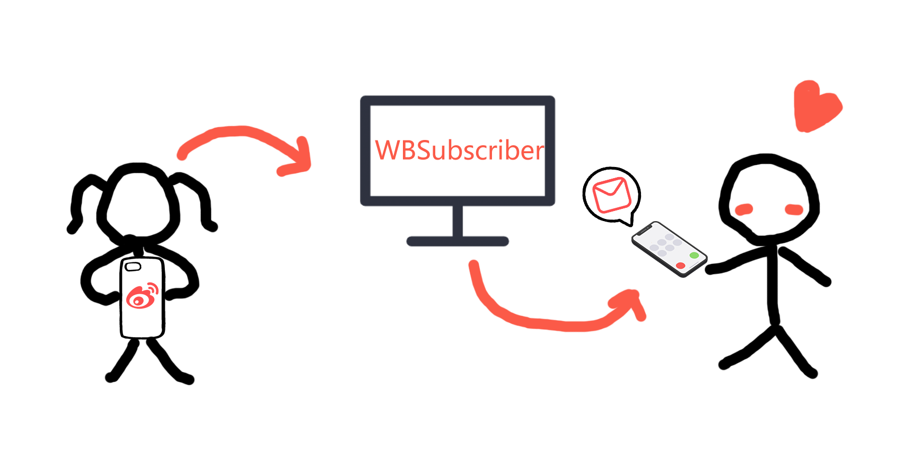
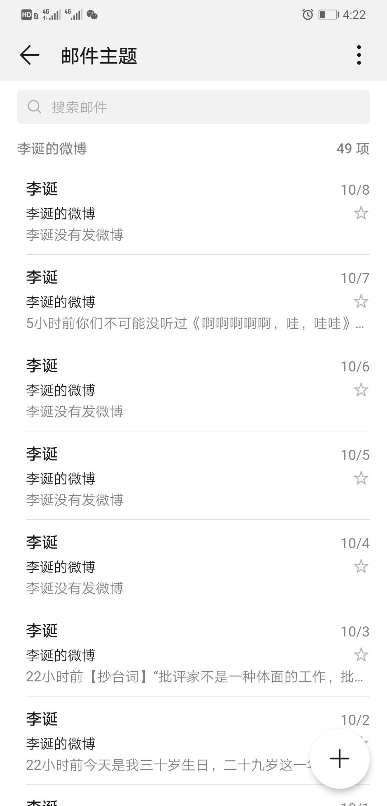
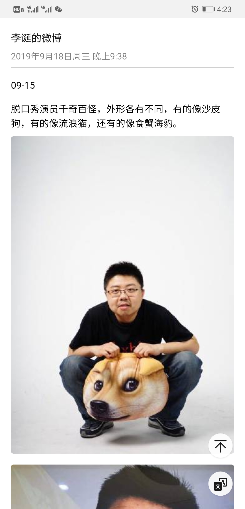
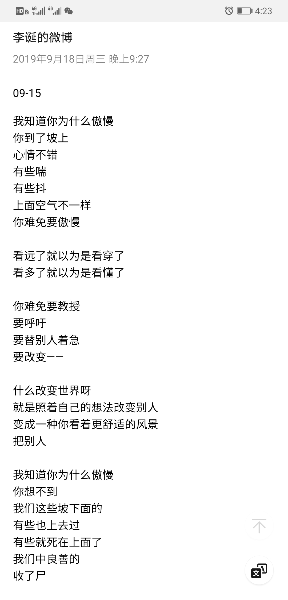
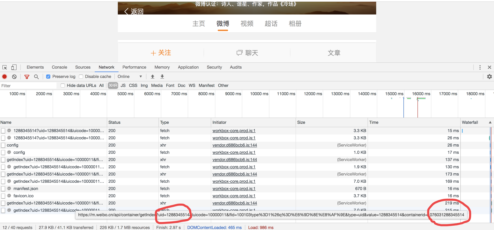

# WeiboSubscriber
**WeiboSubscriber**是一个针对特定微博用户，例如你关注的明星、你喜欢的小姐姐的订阅工具。该工具可以通过爬虫每天定时爬取某一用户的微博内容，将其更新动态发送至你的邮箱。



<br>

#### 功能展示

---

**WeiboSubscriber**可以实现每天定时检索你的关注人的新动态，并把他/她的动态发到你的邮箱。支持多种微博内容（图片、文字、长微博、转发微博等，视频、音频附链接）。

<center class="half">
      
    <p> 邮件列表、带图微博、长微博</p>
</center>

<br>

#### Requirements

- python 3.6
- APScheduler 3.6.0
- requests 2.21.0

<br>

#### 使用方法

---

**Step1** 修改`config.py`中的参数实现订阅对象和邮箱的指定。

```python
uid = '1288345514'   
user_name = u'李诞'   # 关注人姓名
containerid = '1076031288345514'
from_addr = '123456789@qq.com'  # 发件邮箱
to_addr = '123456789@qq.com'   # 收件邮箱
password = 'yourpassword'   # 你的邮箱密码
from_name = '李诞'   # 设定发件人姓名
to_name = 'plucky'  # 设定收件人姓名
subject = '李诞的微博' # 设定主题
send_hour = 22   # 设定每日发送时间
send_min = 30 
```

`uid`和`containerid`需要通过检查网页元素获取。

1. 浏览器登录`m.weibo.com`，搜索你想要关注的人，进去他/她的主页。
2. 右键检查元素，在`Network`选项卡下，选取`XHR`，刷新页面。
3. 可以在列表的最下方的条目获取到`uid`和`containerid`。

{: .center-image }

<br>

**Step2** 服务器部署

为长期保活，使用`screen`新建一个窗口，然后运行：

```bash
screen -S windowname
python main_frame.py
```

<br>

#### 开发教程

---

日后会在博客里更新。[PluckyMagnent](<http://pluckytyx.top/>)

<br>

#### 其它

---

- 邮箱暂时仅支持QQ邮箱，输入的密码为授权码。QQ邮箱授权码仅有一个月有效期，如有时间会编写其它邮箱的调用模块，也可自行修改。
- 如果想实现实时监控微博或修改check更新的频率，可以重写`main_frame.py`，利用`Apscheduler`中其它类别的scheduler实现不同的定时功能。

<br>

如有问题请发布在issue或联系邮箱inkstoneblack@gmail.com.